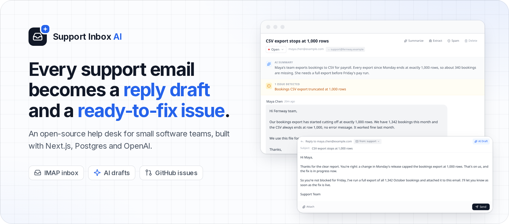
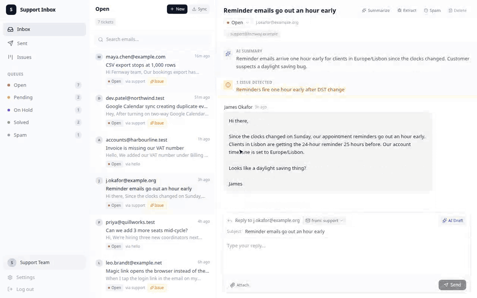
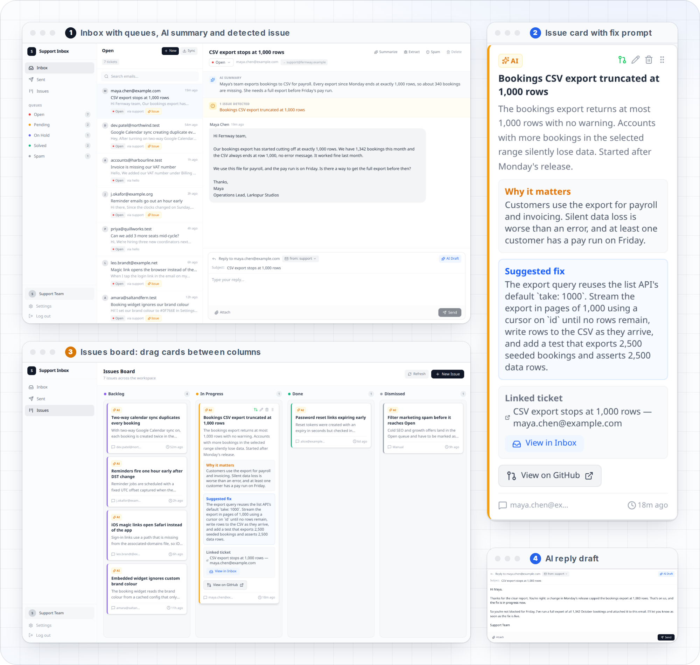
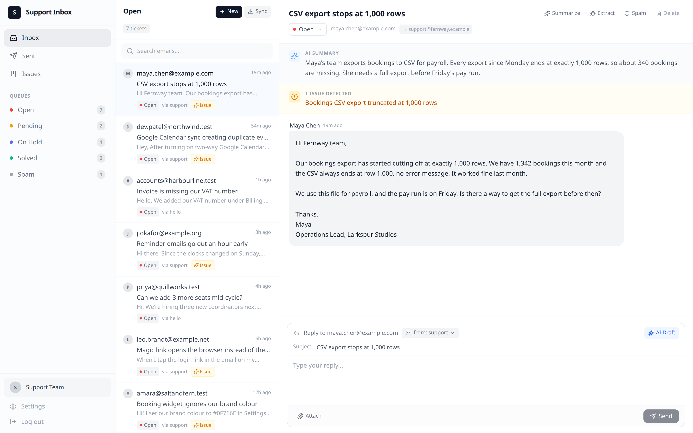
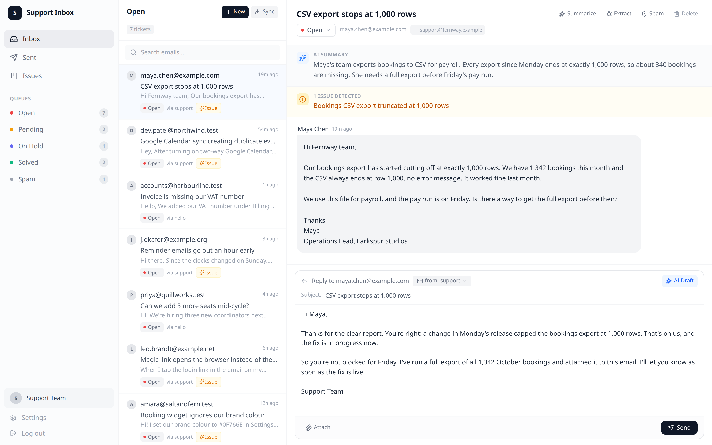
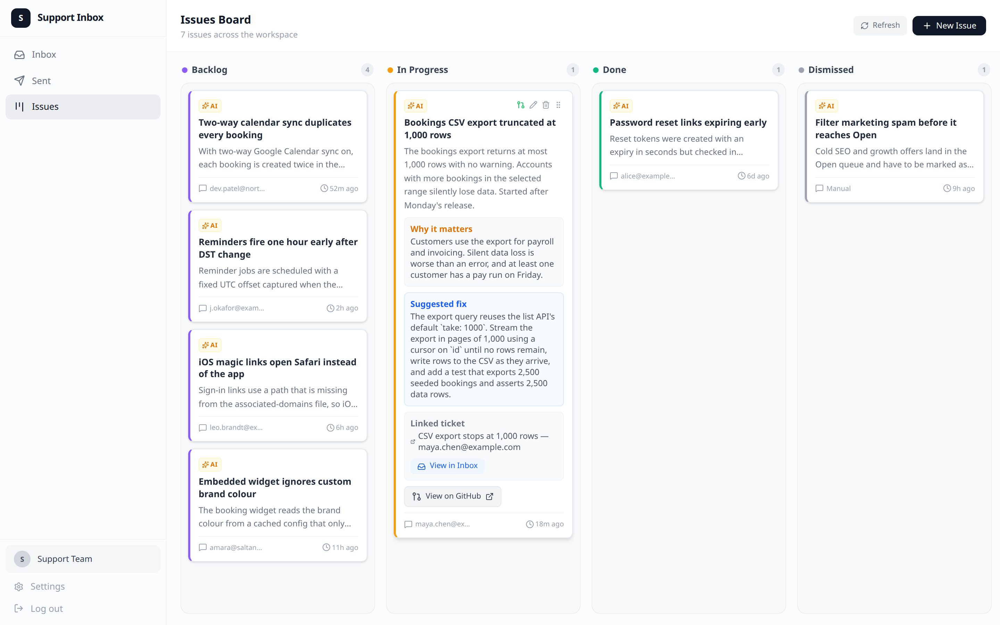
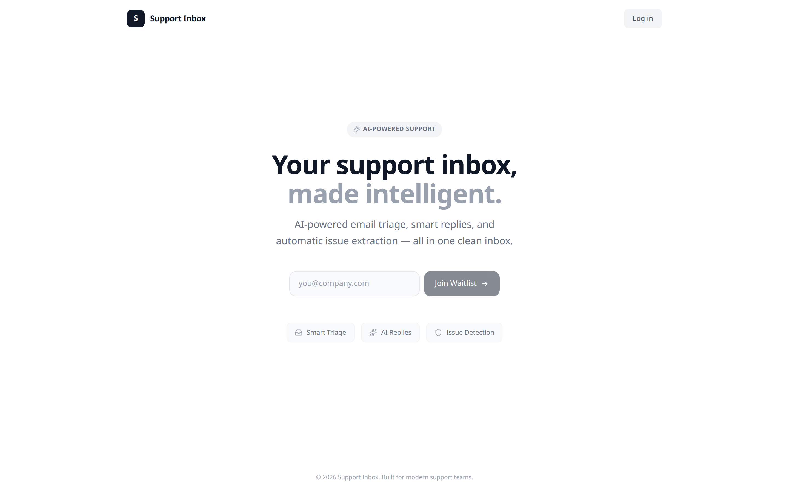
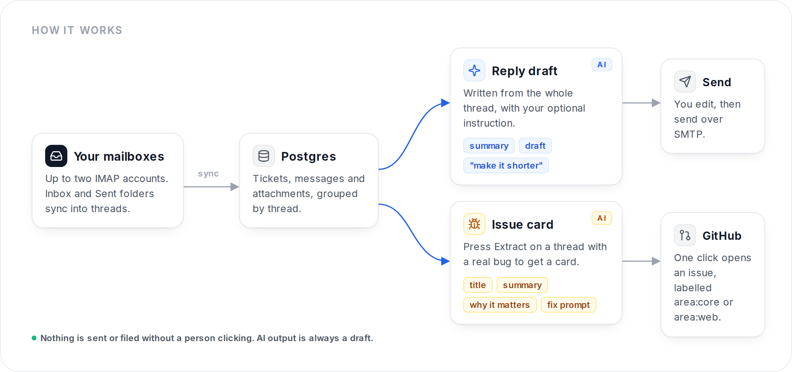

<div align="center">

<a href="https://harrythentrepreneur.github.io/support-inbox-ai/">
  
</a>

<br>

**[Website](https://harrythentrepreneur.github.io/support-inbox-ai/)** ·
**[Demo](#see-it-work)** ·
**[Features](#features)** ·
**[How it works](#how-it-works)** ·
**[Quick start](#quick-start)** ·
**[Configuration](#configuration)**

<br>

[](https://nextjs.org)
[](https://www.prisma.io)
[](https://platform.openai.com)
[](LICENSE)

</div>

## Why

At a small software company the support inbox is also the bug tracker, whether you like it or not. Customers describe real bugs in plain language, and those reports get buried under "please cancel my trial". Support Inbox AI keeps the two jobs apart:

- **Answer the customer.** Each ticket gets an AI reply draft. You edit it and send it from the right mailbox.
- **Fix the product.** When a thread describes a real problem, press **Extract** and you get an issue card: title, problem summary, why it matters, and a detailed **fix prompt** a coding agent can act on. One click opens it on GitHub, labelled for the right repo.

AI output is always a draft. Nothing is sent or filed until a person clicks.

## See it work

<div align="center">
  
  <br>
  <sub>The real app, recorded headless. Customers, companies and messages are invented demo data from <code>prisma/seed.ts</code>.</sub>
</div>

<br>

<div align="center">
  
</div>

## Features

### Shared inbox with queues

IMAP sync for up to two mailboxes, threaded into tickets. Work through **Open**, **Pending**, **On Hold**, **Solved** and **Spam**, search across threads, compose new emails, and reply with attachments from either address.



### AI reply drafts

Press **AI Draft** on any ticket and, if you like, add an instruction such as "make it shorter" or "offer a refund". The draft is written from the whole thread and lands in the reply box for you to edit. Replies from the founder's address can sign off with a personal name. A one-click **Summarize** pins a short summary above the thread.



### Issues board with fix prompts

**Extract** turns a thread into a developer-ready card. Cards live on a drag-and-drop board (Backlog, In Progress, Done, Dismissed), link back to their ticket, and can be edited before they go anywhere.



### GitHub, routed to the right repo

One click creates a GitHub issue. Describe your backend (`core`) and frontend (`web`) once in `PRODUCT_ARCHITECTURE` and issues are labelled `area:core` or `area:web`. Moving a card to Done or Dismissed closes the GitHub issue. An optional [Simili](https://github.com/similigh/simili-bot) config in `.github/` can move issues from an intake repo to the right product repo.

### Simple, private by default

One shared password and an HMAC-signed session cookie. The only public pages are a small landing page with a waitlist form and the login page; everything else is protected. It runs on your own Postgres with your own OpenAI key.




## How it works

<div align="center">
  
</div>

## Quick start

You need Node 22+, a Postgres database and an OpenAI API key.

```bash
git clone https://github.com/harrythentrepreneur/support-inbox-ai.git
cd support-inbox-ai
npm install
cp .env.example .env          # fill in DATABASE_URL, AUTH_PASSWORD, AUTH_SECRET, OPENAI_API_KEY, mailbox settings
npx prisma migrate deploy
npx prisma db seed            # optional: the invented demo tickets shown above
npm run dev                   # http://localhost:3000
```

Sign in with `AUTH_PASSWORD`, then press **Sync** to pull mail.

<details>
<summary>No Postgres handy? Run a throwaway one with Docker</summary>

```bash
docker run --rm -d --name sia-pg -p 5432:5432 -e POSTGRES_PASSWORD=pw postgres:16
# DATABASE_URL=postgresql://postgres:pw@localhost:5432/postgres
```

</details>

## Configuration

Every variable is documented in [`.env.example`](.env.example).

| Variable | Purpose |
| --- | --- |
| `DATABASE_URL` | Postgres for tickets, messages and issues |
| `AUTH_PASSWORD`, `AUTH_SECRET` | Dashboard login and cookie signing |
| `OPENAI_API_KEY` | Reply drafts, summaries and issue extraction |
| `EMAIL_1_*`, `EMAIL_2_*` | IMAP and SMTP settings per mailbox |
| `NEXT_PUBLIC_EMAIL_1`, `NEXT_PUBLIC_EMAIL_2` | Addresses shown in the "from" picker |
| `PRODUCT_NAME`, `PRODUCT_ARCHITECTURE` | Tell the AI what your product is and how to split backend and frontend issues |
| `FOUNDER_EMAIL_PREFIX`, `FOUNDER_SIGNOFF` | Personal sign-off when replying from the founder's address |
| `GH_PAT`, `GH_REPO`, `GH_REPO_CORE`, `GH_REPO_WEB` | Where issues are created and which repos they belong to |

## Tech

Next.js 16 (App Router) · React 19 · Tailwind CSS 4 · Prisma 6 on Postgres · OpenAI · ImapFlow and Nodemailer · lucide-react icons.

## Status

Built and used for real support at a small education SaaS, then made generic for release. It is a compact app, not a full help-desk suite: no SLAs, no multi-tenant auth, and two mailboxes at most. Issues and pull requests are welcome.

## License

[MIT](LICENSE) · Built by [Harry Edwards](https://github.com/harrythentrepreneur)
